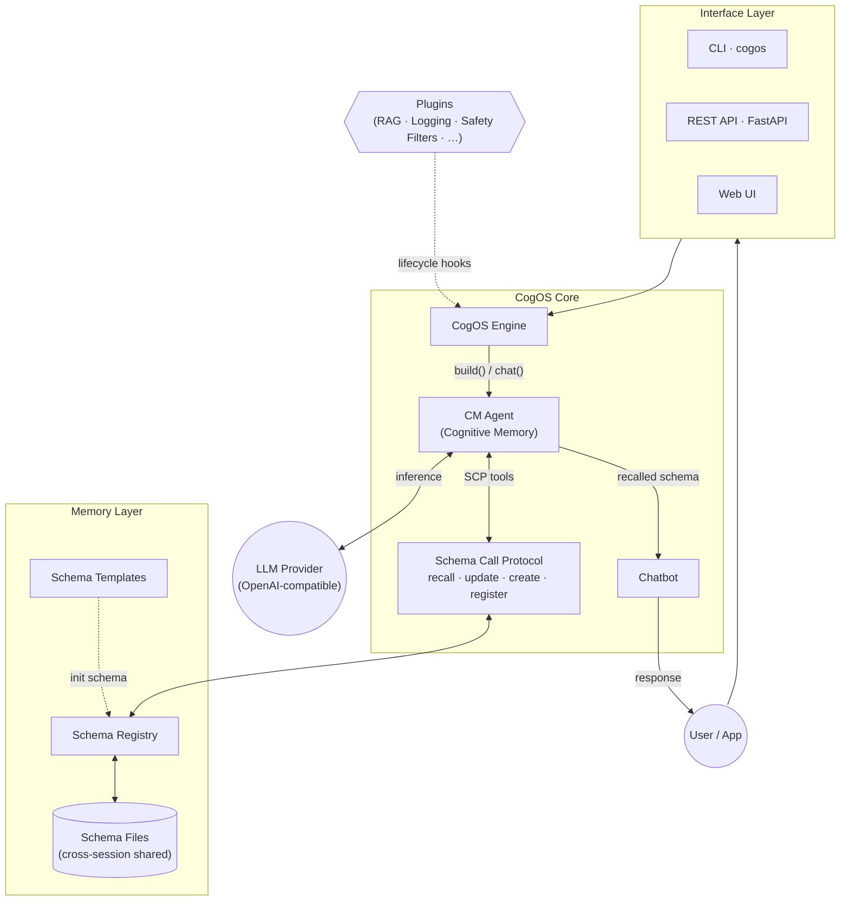

CogOS is structured in three layers: **Interface**, **Core**, and **Memory**.



## Interface Layer

Multiple ways to interact with CogOS:

| Interface | Description |
|-----------|-------------|
| **CLI** (`cogos`) | Command-line for init, build, chat, serve |
| **REST API** (FastAPI) | Full HTTP API for programmatic integration |
| **Web UI** | Browser-based chat with schema inspection |

## Core Layer

The engine orchestrates two main components:

- **CM Agent (Cognitive Memory)** — An LLM-powered agent that reads user input and decides which schema operations to perform. It uses the Schema Call Protocol tools to read/write structured memory.
- **Chatbot** — Generates responses grounded in recalled schema data.

## Memory Layer

- **Schema Registry** — In-memory registry of all schema domains and their fields.
- **Schema Files** — Standalone JSON files on disk, shared across sessions.
- **Schema Templates** — Pre-defined field structures that bootstrap new schemas.

## Plugins

Optional plugins hook into the engine lifecycle (before/after build and chat) without modifying core code. Common uses include RAG retrieval, logging, and safety filters.

## Project Structure

```
CogOS/
├── src/cogos/                     # Package root
│   ├── __init__.py               # CogOS class & public API
│   ├── config.py                 # CogOSConfig (env + YAML)
│   ├── converters.py             # Input format converters
│   ├── helpers.py                # Forget / sensitive-field utilities
│   ├── plugins.py                # Plugin system (CogOSPlugin protocol)
│   ├── prompts.py                # Default prompts
│   ├── templates.py              # Schema templates & TemplateRegistry
│   ├── core/                     # Core cognitive memory system
│   │   ├── agent.py              # CogAgent — LLM ↔ SCP tool loop
│   │   ├── llm.py                # Async LLM client
│   │   ├── protocol.py           # Schema Call Protocol (SCP)
│   │   ├── schema.py             # UniversalSchemaDomain & SchemaRegistry
│   │   └── state.py              # State, StateManager & SchemaFileManager
│   └── server/                   # User-facing interfaces
│       ├── api.py                # FastAPI REST service
│       ├── cli.py                # Click-based CLI
│       └── web/static/           # Web UI
├── cogos-openclaw-plugin/        # OpenClaw Context Engine plugin
├── templates/                    # Schema templates (JSON)
│   └── custom/                  # User custom templates (git-ignored)
├── schemas/                      # Standalone schema files (cross-session)
├── configs/                      # Configuration files
├── tests/                        # Unit tests
└── examples/                     # Example code
```
